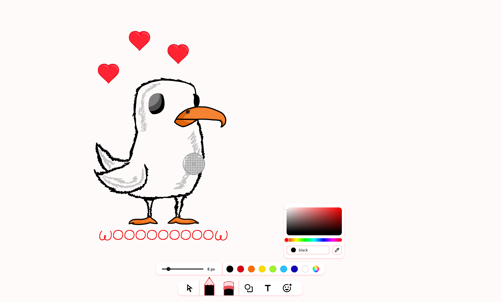
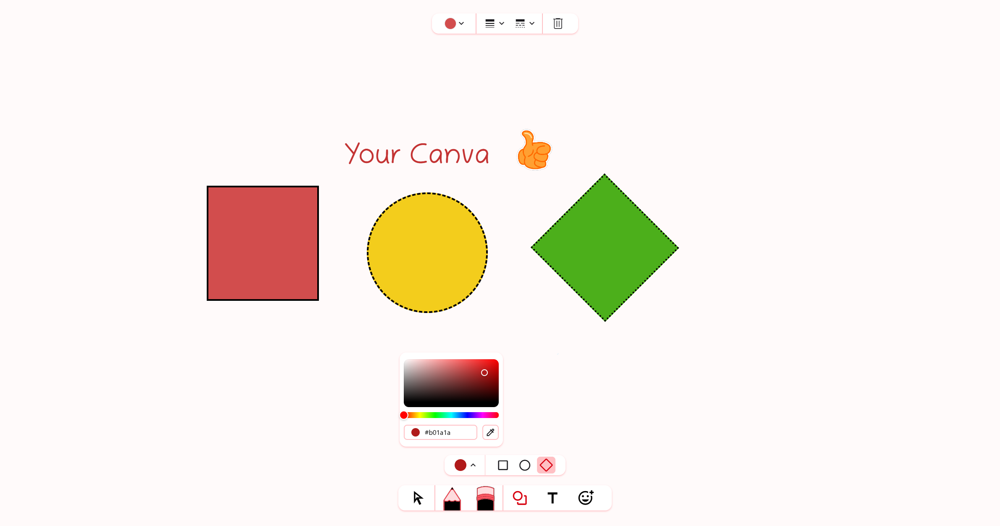

# Whiteboard App

This project is a custom-built whiteboard web application designed for drawing, sketching, and note-taking directly in the browser. It is created entirely from scratch without using any external whiteboard or drawing libraries.

## Tech Stack

- Frontend: Next.js, TypeScript, Tailwind CSS

- Design Tools: Figma, Krita

- Core Technology: Pure HTML Canvas API (no external drawing libraries)

## Features

- Freehand drawing with fully custom canvas logic

- Shape tools and color options

- Panning & smooth canvas movement

- Zooming functionality with scroll and controls

- Sticker support (place, move, resize)

- Clean, responsive, and fast UI

## Screenshots

> [!NOTE]
>
> ## Design & Art
>
> The entire website, including the UI/UX layout and visual design, was created by me
> All design elements, illustrations, and graphics were created by me also:)
